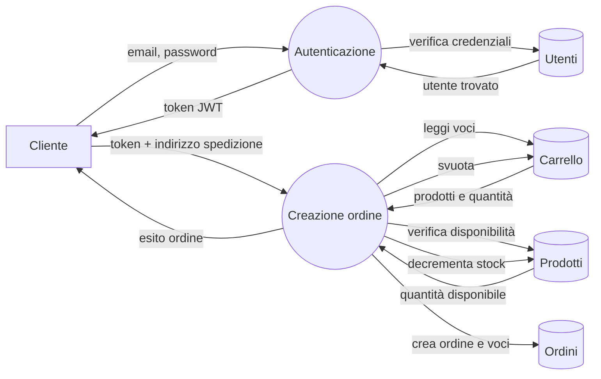
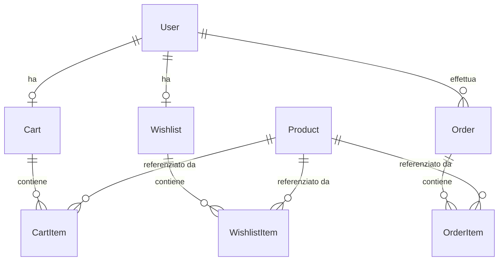

# Specifiche del progetto

Documento che accompagna il [README](README.md) e descrive **cosa** fa
l'applicazione (e cosa intenzionalmente non fa), per chi è pensata, e quali
vincoli hanno guidato le scelte progettuali. Il README spiega invece
**come** installare, avviare e usare l'applicazione.

## Cos'è l'applicazione

Un'applicazione web full-stack di e-commerce: un esercente espone online il
proprio catalogo di prodotti e i clienti li acquistano attraverso il classico
flusso carrello → checkout → ordine. L'applicazione gestisce internamente
autenticazione, persistenza di carrelli, wishlist e ordini, e un pannello
amministrativo per la gestione del catalogo.

Nasce originariamente come progetto per l'esame di Progetto di sistemi Web, poi modificato per renderlo coerente con quanto richieesto dalle specifiche dell'esame Ingegneria del Software Avanzata, Corso di Laurea Magistrale in Ingegneria Informatica e dell'Automazione.

## Utenti del sistema

Tre profili distinti:

- **Guest** — utente non autenticato. Può consultare il catalogo
  pubblico (ricerca, filtri, ordinamento) ma non può usare carrello,
  wishlist o completare ordini.
- **Cliente** (`user`) — utente registrato. Ruolo assegnato di default alla
  registrazione (non è possibile registrarsi come admin via API). Gestisce
  il proprio carrello, la propria wishlist e completa ordini.
- **Amministratore** (`admin`) — utente con privilegi estesi. Oltre alle
  funzioni del cliente, gestisce il catalogo prodotti e consulta lo storico
  di tutti gli ordini. Le richieste agli endpoint amministrativi da parte di
  utenti non admin ricevono risposta `403`.

## Cosa fa il sistema

### Catalogo

Mostra l'elenco dei prodotti, accessibile anche senza login. Supporta
ricerca testuale su titolo e descrizione, filtro per intervallo di prezzo
(`min_price`/`max_price`), e ordinamento per prezzo o data di inserimento
(crescente/decrescente; il default è dal più recente). Ogni prodotto ha
titolo, descrizione, prezzo corrente, prezzo originale, flag "in saldo",
thumbnail, lista di tag e quantità in stock.

### Autenticazione

Login con email e password. Le password sono memorizzate solo come digest
BCrypt, mai in chiaro. Al login (o alla registrazione) l'utente riceve un
token JWT firmato (HS256, scadenza 24 ore) con `user_id` e `role`, da
presentare nelle richieste successive nell'header
`Authorization: Bearer ...`. L'email deve essere unica nel sistema.

### Carrello

Ogni cliente ha un carrello persistente lato server, creato al volo alla
prima richiesta autenticata. Aggiungere un prodotto al carrello **congela il
prezzo unitario corrente** nella voce creata: variazioni di listino
successive non alterano le voci già aggiunte. Aggiungere lo stesso prodotto
una seconda volta somma le quantità nella voce esistente invece di crearne
una seconda. Il sistema rifiuta sempre quantità superiori allo stock
disponibile del prodotto.

### Wishlist

Ogni cliente ha una wishlist persistente. L'aggiunta è **idempotente**:
aggiungere due volte lo stesso prodotto non duplica la voce e restituisce
`200` (invece di `201` per una voce nuova). La wishlist è indipendente dal
carrello — non esiste una funzione automatica che sposti gli articoli
dall'una all'altro.

### Checkout e ordini

Il cliente conferma l'acquisto fornendo dati di contatto e indirizzo di
spedizione. La creazione dell'ordine è **transazionale**: in un'unica
transazione il sistema verifica lo stock di tutti i prodotti coinvolti,
crea l'ordine e le sue voci, e decrementa lo stock. Se anche un solo
passaggio fallisce (es. stock insufficiente per uno dei prodotti), nessun
effetto è persistito.

Anche per le voci d'ordine il prezzo unitario viene congelato al momento
della creazione dell'ordine, in modo che lo storico resti fedele a ciò che
il cliente ha visto al momento dell'acquisto. Una volta creato, l'ordine è
**immutabile**: non è previsto un ciclo di vita con stati successivi
(conferma, spedizione, consegna). Dopo un ordine andato a buon fine il
carrello del cliente viene svuotato.

Il cliente può consultare lo storico dei propri ordini, filtrato per
intervallo di date e di importo (`min_total`/`max_total`).

### Pannello amministrativo

L'admin accede a un'area dedicata per gestire il catalogo: lista,
creazione, modifica, cancellazione e regolazione manuale della quantità in
stock dei prodotti. Cancellare un prodotto rimuove in cascata anche le voci
di carrello, wishlist e ordine che lo referenziano.

L'admin può inoltre consultare lo storico di **tutti** gli ordini del
sistema (non solo i propri) con statistiche aggregate (numero ordini,
ricavi totali, utenti totali, prodotti totali, prodotti sotto scorta con
soglia fissata a 10 unità). Cancellare un ordine dal pannello admin
**ripristina automaticamente** la quantità in stock dei prodotti coinvolti.

## Requisiti non funzionali

- **Sicurezza**: password mai in chiaro (BCrypt), autenticazione a token
  (JWT con scadenza), autorizzazione basata su ruolo per gli endpoint
  amministrativi, CORS configurato esplicitamente.
- **Affidabilità dei dati**: le operazioni che coinvolgono più tabelle
  correlate (creazione ordine, cancellazione prodotto/ordine) sono
  transazionali o gestite con cascade/callback, per evitare stati
  intermedi inconsistenti.
- **Portabilità/Deployment**: backend e frontend sono entrambi
  containerizzati (immagini Docker multi-stage), orchestrabili in locale
  con `docker-compose`.

## Cosa il sistema intenzionalmente non fa

- Nessun ciclo di vita dell'ordine (stati, cancellazioni post-acquisto,
  resi): un ordine è una fotografia immutabile dell'acquisto.
- Nessun pagamento reale integrato: il checkout raccoglie dati di
  spedizione, non elabora transazioni di pagamento.
- Nessuna funzione di recupero password o notifica via email.

## Qualità attese

- **Isolamento dei dati per utente**: un cliente non può leggere né
  modificare voci di carrello o wishlist di un altro utente. Le query sono
  scope alla relazione dell'utente autenticato (`current_user.cart.cart_items`,
  non `CartItem.find`), quindi un tentativo di accesso a una voce altrui
  risponde `404` (non trovata), non `403` — coerente con il principio di non
  rivelare l'esistenza di risorse di altri utenti.
- **Coerenza storica dei prezzi**: il prezzo unitario memorizzato in una
  voce di carrello o d'ordine non cambia se il prezzo del prodotto cambia
  successivamente (congelato al momento dell'aggiunta/acquisto).
- **Atomicità del checkout**: la creazione di un ordine avviene in
  un'unica transazione database; se un solo prodotto ha stock
  insufficiente, nessun ordine, voce d'ordine o decremento di stock viene
  persistito (nessuno stato intermedio inconsistente).
- **Unicità delle voci**: un prodotto compare al più una volta per
  carrello, per wishlist e per ordine (indice unico composito a livello di
  database, non solo controllo applicativo).
- **Riproducibilità del build**: dipendenze pinnate nei file di lock
  versionati (`Gemfile.lock`, `package-lock.json`), immagini Docker
  buildabili dai `Dockerfile` versionati.

## Vincoli tecnologici e di processo

- **Backend**: Ruby on Rails 8 in modalità API, database SQLite.
- **Frontend**: Angular con TypeScript e Angular Material.
- **Comunicazione client/server**: HTTP/JSON (REST). Nessun WebSocket.
- **Autenticazione**: JWT firmati HS256, nessuna sessione lato server.
- **Distribuzione**: container Docker buildati dai Dockerfile versionati,
  pubblicati su GitHub Container Registry al push di un tag SemVer.
- **Sviluppo**: flusso basato su branch `feature/*` e pull request verso
  `main`, con pipeline CI (lint, security scan, test, build) eseguita ad
  ogni PR; commit nello stile Conventional Commits.

## Flusso di checkout (DFD)

Per dare un'immagine compatta del comportamento del sistema, un Data Flow
Diagram del flusso più critico: dalla login del cliente alla creazione di
un ordine.

**Notazione** (convenzione DFD): i **cerchi** sono le **funzioni** del
sistema, i **cilindri** gli **archivi persistenti** (tabelle del DB), i
**rettangoli** gli **agenti esterni**, le **frecce etichettate** i
**flussi di dati** (cosa viaggia, non quando o in che ordine — un DFD non
rappresenta sincronizzazione né controllo di flusso).

**Come si legge**: `Creazione ordine` legge le voci da `Carrello` e
verifica la disponibilità su `Prodotti` prima di scrivere su `Ordini` e
decrementare lo stock — il diagramma rende esplicito che la
verifica precede la scrittura, senza però specificare (non è compito di
un DFD) che l'intera sequenza è una singola transazione atomica: quel
vincolo è descritto a parole nella sezione "Qualità attese".

## Modello dei dati

Sette entità persistenti collegate come segue:

- **User** — identità (email univoca, password digest, ruolo `user`/`admin`).
- **Product** — articolo del catalogo. Identificatore stringa (non
  auto-incrementale).
- **Cart / CartItem** — carrello del cliente e le sue voci. Una voce è
  univoca per coppia `(cart, product)` (indice unico a database).
- **Wishlist / WishlistItem** — equivalente per la wishlist. Una voce è
  univoca per coppia `(wishlist, product)`.
- **Order / OrderItem** — ordine confermato e le sue voci. Il prezzo
  unitario è quello vigente al momento dell'ordine e non viene più
  aggiornato. Una voce è univoca per coppia `(order, product)`.

Per gli attributi di dettaglio di ogni entità, vedi la sezione "Diagramma
delle Entità" nel [README](README.md).

## Glossario

- **Cart Item**: voce del carrello, lega un prodotto a una quantità e al
  prezzo unitario congelato al momento dell'aggiunta.
- **Wishlist Item**: voce della wishlist, lega un prodotto senza quantità
  né prezzo (a differenza del carrello).
- **Order Item**: voce d'ordine, come il Cart Item ma immutabile e legata a
  un ordine anziché a un carrello.
- **Stock/quantità**: numero di unità disponibili di un prodotto,
  decrementato alla creazione di un ordine e ripristinato alla sua
  cancellazione da parte dell'admin.

## Riferimenti

- [README.md](README.md) — installazione, avvio, struttura del progetto.
